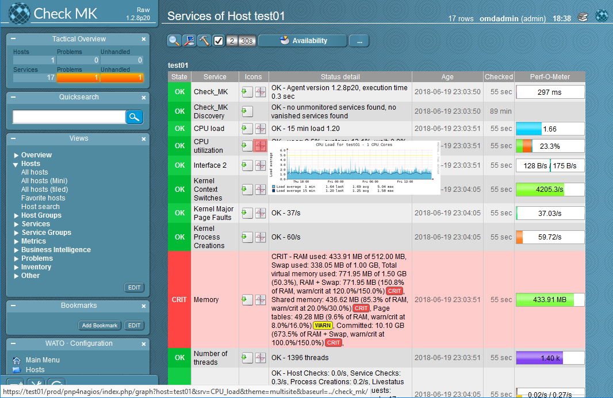
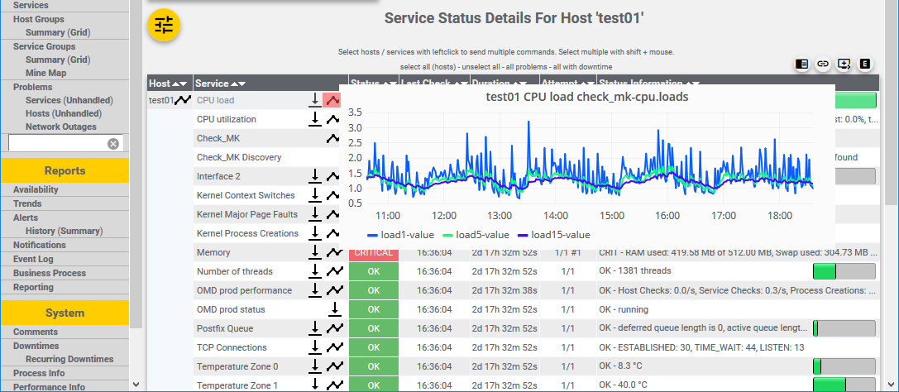
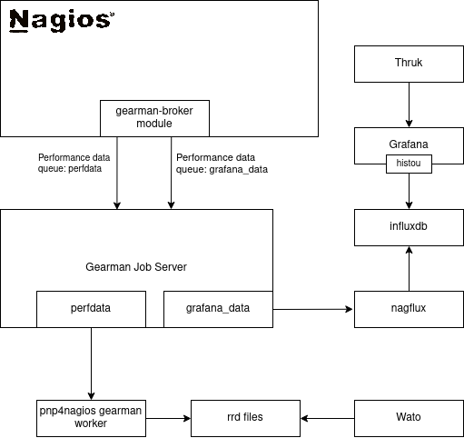

# Ansible Checkmk

The intention of this ansible role is to replicate some of the functionality from the [OMD](https://labs.consol.de/de/omd/) v2.X packages with focus on Checkmk RAW Edition. OMD hasn't updated Checkmk in years and finally removed it from version 3. So this role is going to install the following tools and pre-configure them:

* [x] [Checkmk RAW Edition](https://mathias-kettner.de)
  * [ ] Checkmk Master / Slave Configuration (optional)
  * [x] Dual Graphing pnp4nagios and InfluxDB/Grafana
* [x] [Mod-Gearman](https://mod-gearman.org/)docker
  * [x] Gearman Job Server
* [x] [Thruk](https://www.thruk.org)
  * [x] Granting default Checkmk User administrative permission
  * [x] Pre-configuring Checkmk Site in Thruk
* [x] [Grafana](https://grafana.com)
  * [x] [Histou](https://github.com/Griesbacher/histou)
  * [x] Adding InfluxDB Nagflux datasource
* [x] [InfluxDB](https://www.influxdata.com)
  * [x] Pre-configuring Nagflux database
* [x] [Nagflux](https://github.com/Griesbacher/nagflux)
* [x] Single-Sign on for Checkmk / Thruk / Grafana (see [Authentication](#authentication))
  * [ ] Multisite Authorization

With these tools installed Checkmk writes all performance data as pnp4nagios rrd graphs, viewable within Wato, and into an influxdb, viewable as Grafana graph template within Thruk. Of course the data within influxdb can also be used to create custom Grafana dashboards.

I assume you have a process in place to configure apache2 with a valid TLS configuration because by default all WebUIs are only accessible via http. A valid TLS configuration is out of scope of this role.

## Supported Operating Systems

* Ubuntu 20.04
* Ubuntu 18.04

## Role Variables

All variables are defined in defaults/main.yml.

## Example Playbook

    ---
    - hosts: checkmk_server
      roles:
        - Madic-.ansible-check_mk
      vars:
        - cmk_site_name: cmk

## Configuration Files

This role should be idempotent, like any other ansible role. Because of this I try to use locations for the configuration files which will not get overwritten when changing settings on the web interfaces of the different tools.

### Thruk

    /etc/thruk/menu_local.conf
    /etc/thruk/thruk_local.d/thruk_ansible.conf

Configurations located beneath /etc/thruk/thruk_local.d will not be shown in the Thruk WebUI, e.g. the backend configuration. If I would use /etc/thruk/thruk_local.conf changes done in the Thruk WebUI would get overwritten when running the role again.

#### Grafana

    /etc/grafana/provisioning/datasources/influxdb-nagflux.yml

Provisioning file for the nagflux database.

### Apache2

    /etc/apache2/conf-enabled/grafana.conf
    /etc/apache2/conf-enabled/histou.conf

## Authentication

This role enables authentication for Grafana through Thruk. The users can be managed in Wato as htpasswd users. By default no user, except for the user created through this role, has permission to access any information from within Thruk. To give another user permissions use the Thruk Config Tool --> "User Settings" or "CGI & Access" options. LDAP is not yet possible.

## Dataflow

Because I tend to forget how and where the data gets processed, I did a small picture.

## Container image

At first I intended to also provide a container, e.g. docker, image. But this role has so many moving parts and dependencies that it would take huge effort to create one or multiple images. Though I'm not reluctant if someone would work on it and would support it. At the moment I'm deploying it in LXC Containers.

## Credits

Special thanks goes out to the people from [Consol](https://www.consol.de/). Without their work this role wouldn't be possible.
